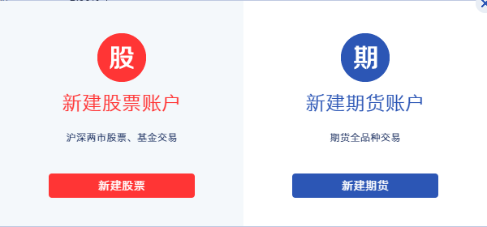
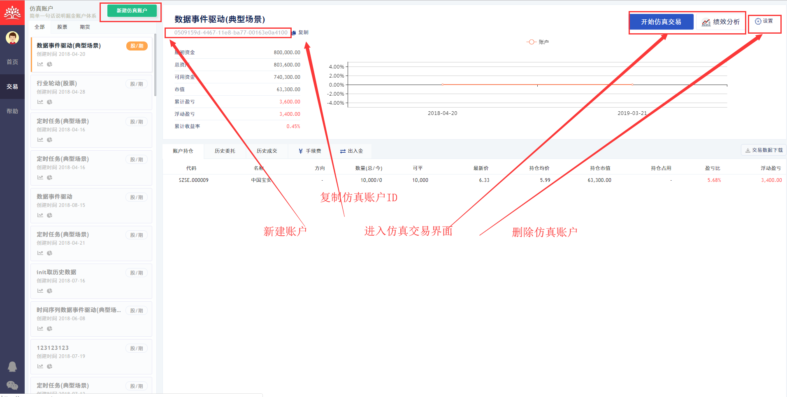
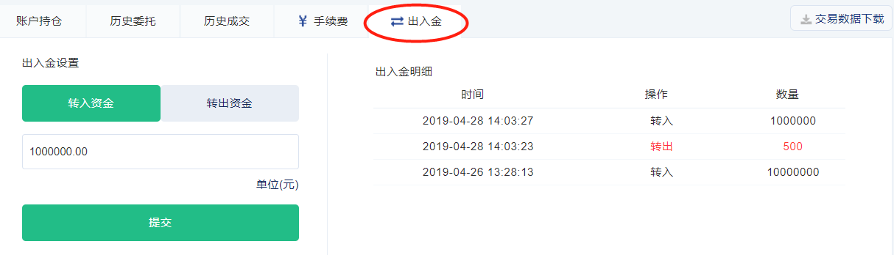
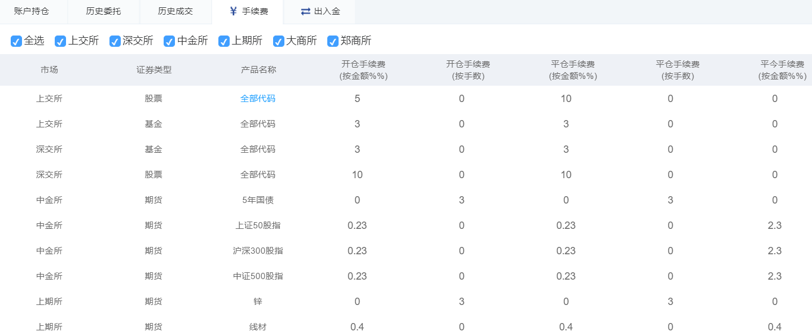
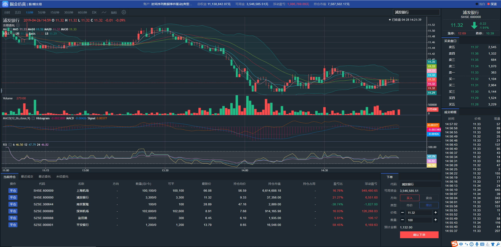
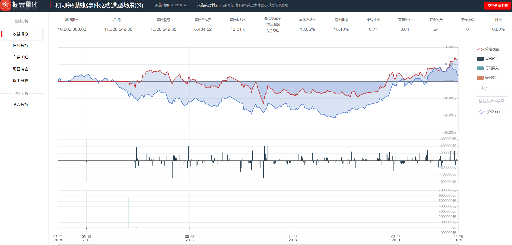
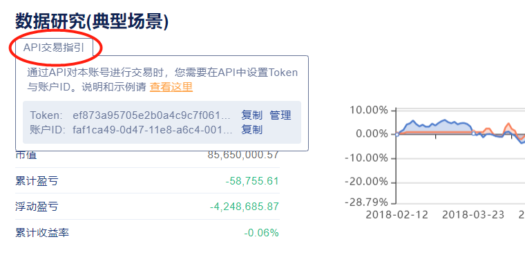

## 产品与服务

-------
掘金仿真交易是为量化投资者打造的一个最接近真实市场环境的仿真平台，旨在以坚实的IT技术，助力化量化投研与投资。
本服务主要面向量化投研机构和个人服务，提供整套证券仿真交易的信息化技术平台

投资者可通过掘金官网注册（ https://www.myquant.cn ）后使用。
本服务适用于量化策略开发的检验、测试、优选，提高投资策略实战能力；也提供独立部署，用于证券投研、培训、教育及投资大赛

## 5分钟上手指引

让我们一起花上5分钟，快速上手掘金仿真，交易起来！如果您希望通过API接入，请参考下面的`API接入交易指引`部分。

### 创建一个交易账户

首先，您需要开通一个交易账户。掘金仿真支持两类账户，一类是股票账户，可以交易沪深两市的股票和基金；另一类是期货账户，可以交易国内5个期货交易所的商品期货与股指期货。

第一步，输入您的掘金用户名和密码，登录掘金仿真服务。如果还没有掘金用户，请点击首页右上角的`新用户注册`，注册一个用户。

第二步，进入`交易`页面，点击`新建账户`，选择“股票”或“期货”类型账户。然后，给这个账户取个名字，设置初始资金。如下图：




账户新建完成后，您可以看到这个账户汇总信息界面。在这里，账户的资金/持仓/委托/成交信息一览无遗。也可以从这里进入其它功能入口，比如手工交易和绩效分析。


这样就搞定了，账户已经可以开始交易。

### 出入金与手续费

#### 出入金设置

创建账户时，您已经设置了账户的初始资金。如果后面需要调整账户的资金，可以进入`出入金`界面，增加或减少账户的资金，资金调整立即生效，资金调整的流水记录显示在右边。


#### 手续费设置

掘金仿真有非常强大的手续费计算模型，支持与真实市场一样的手续费设置，可按交易方向/交易额/交易手数等收取交易费用。手续费默认设置与市场标准一致，同时，您可以按照自己的需求修改单个账户的手续费设置。


### 开始手工交易

接下来，您可以开始交易了。咱们先开始试试手工交易，掘金仿真拥有完美的手工交易功能，K线/指标/图表/实时交易信号，一应俱全。点击`开始交易`，打开交易监控界面，聪明如您，接下来肯定知道该怎么做了。





### 下载交易数据

有时您也许需要下载交易数据到本地进行分析，点击`交易数据下载`，一键即可下载完整的账户数据到本地，包括：资金，持仓，历史委托，历史成交数据。数据格式为标准的CSV，方便分析。

### 对我的交易做绩效分析

最棒的功能来了，掘金仿真与绩效分析服务无缝接通，您也许想系统地分析分析自己的交易账户，对比一下风险和收益，看看交易信号是否准确的反映自己的交易逻辑，这时，只需点击`绩效分析`，等待几秒钟（看您的交易数据多少），专业、完整的绩效分析报告就出来了，您甚至可以下载PDF版本报告。



## API交易接入指引
掘金仿真提供强大的AP接入方式。使用掘金API，您可以下单、撤单，查询资金、持仓与委托成交数据。另外掘金仿真还提供了实时消息推送接口，委托状态变化、成交回报等消息会以实时的方式推送给您。

掘金仿真提供Python与C++两种语言的SDK，详细的说明、示例与API手册请参考下面对应语言的SDK文档。这里我们以Python为例，介绍API接入的最重要的注意事项。

### 下载交易SDK

**python交易SDK下载**
- 版本支持： Python3.6 +
- 操作系统： Windows64/32;  Linux64/32
- 安装包存放在pypi仓库中，推荐用标准库安装方式安装`gmtrade`在cmd窗口python.exe文件目录下执行
  
```
    pip install gmtrade
```

**C++交易SDK下载：**

- 操作系统：Windows 64/32; Linux 64/32
- 点击下载：[Windows版](https://www.myquant.cn/download/sdk?type=2&platform=windows&lang=cpp)
- 点击下载：[Linux版](https://www.myquant.cn/download/sdk?type=2&platform=linux&lang=cpp)

### 配置服务地址

仿真服务的API接入地址（ip:port)，默认接入地址：`api.myquant.cn:9000`
```
set_endpoint("api.myquant.cn:9000")
```

### 仿真账户登录

账户登录需要正确设置`token`, `账户ID`2个参数，API支持同时登录多个账户，以支持多账户对冲和套利的场景；多账户交易时，API调用需要指定对应的账户ID，指明当前对哪个账户进行交易。

> 注意： `token`是用户的身份识别，相当于您的用户ID+密码，请一定不要泄露。万一泄露，您可以到网站首页右上角的`用户->个人中心->安全设置`中重新生成您的token。新的token重新生成后，旧的token会自动失效。




账户登录代码片段

```
# 本示例运行于python3.6及以上版本
from gmtrade.api import *

# token身份认证
set_token("your token")

# 示例中为掘金官方仿真服务地址；如API接入掘金终端，则填空字符串
set_endpoint("api.myquant.cn:9000")

# 登录账户，account_id为账户ID，必填；account_alias为账号别名，选填
a1 = account(account_id='', account_alias='')
# 可login多个账户，如login(a1, a2, a3)
login(a1)  

```

### 进行交易和查询

详情请参考SDK文档的示例和API说明，以下是交易/查询API一览

```python

# 按指定量委托,返回order结构
order_volume()

# 批量委托接口，返回多条order结构
order_batch() 

# 撤销委托
order_cancel()

# 撤销所有委托
order_cancel_all()
 
# 平当前所有可平持仓
order_close_all()

# 查询日内全部未结委托，返回order结构
get_unfinished_orders()
 
# 查询日内全部执行回报
get_execution_reports()
 
# 查询账户持仓，返回position结构
get_position()

# 查询账户资金，返回cash结构
get_cash()


```

接口返回值标准order、execrpt、cash、position对象，详情参照各语言接口字段对象


### 接收交易事件

仿真服务支持实时交易信息推送接口，委托状态、成交回报等数据在交易过程中会实时推送给程序。接收实时数据需要调用`start()`函数启动消息泵，详细说明请见SDK文档。以下是交易事件一览。

```
# 委托状态更新事件
on_order_status

# 委托执行回报事件
on_execution_report

# 交易账户状态更新事件
on_account_status

# 交易通道网络连接成功事件
on_trade_data_connected

# 交易通道网络连接断开事件
on_trade_data_disconnected

# 错误事件
on_error
```


事件回调的参数字段格式参照各语言接口字段对象

## 交易规则说明

### 仿真交易品种

| 市场      | 股票        |基金       |  期货 |
|:--------:|:----------:|:------------:|:---------:|
|    上交所        |      √       |     √   |    --      |
|     深交所      |       √       |      √  |     --      |
|    中金所      |         --     |   --     |      √     |
|    大商所     |       --       | --       |     √      |
|    郑商所     |      --        |   --     |     √      |
|    上期所    |        --      |    --    |     √      |
|  上海能源交易所 |    --     |   --    |    √     |


### 撮合规则

参照交易所委托撮合规则
- 接入tick行情，对符合成交的委托进行盘口数据逐档量、价撮合
- 委托挂单机制，对暂不满足成交条件的委托进行挂起，等待条件满足时再撮合
- 支持现价撮合模式， 全天实时撮合；委托与交易标的最新价或指定限价进行撮合。用于满足随时调试策略的场景。
> 仿真撮合无法模拟交易冲击成本，可能会导致较大笔委托的成交价格优于实际价格

### 结算规则 
- 实时结算模式：盘中交易时，根据交易实时结算账户的资金和持仓数据。
- 盘后结算模式：盘后校验账户全天交易数据；期货合约过期自动交割。

### 手续费规则
- 股票的佣金/印花税/过户费，支持按设定的费率收取。
- 期货的手续费，支持按交易方向/交易额/交易手数收取。

### 保证金规则
- 期货保证金比率按交易所默认的规则设置。

### 分红送配
- 股票账户自动根据分红配送数据，调整账户的资金和持仓数量。

### 委托类型 
- 支持股票与期货的市价单/限价单
- 支持`FAK/FOK/GFD/BOC/BOP/B5TC/B5TL`等交易属性设置

### 委托验证 
- 支持委托验证：开仓验资/平仓验券/标的代码/价格/数量等字段合法性

### 交易时段 
- 期货市场日盘/夜盘，与交易所真实规则相同
- 股票市场集合竞价时段，连续竞价交易时段

### 资金调整 
- 支持对账户资金转入转出。

### 挂单冻结 
- 开仓委托尚未成交时，冻结对应资金；
- 平仓委托尚未成交时，冻结对应持仓；
- 委托已成/已撤/过期时，解除对应冻结。

### 交易时间与特殊事件

每个市场支持：`初始化时间，开市时间，收市时间，结算时间`4个特殊的时间点，在每个时间点对应市场可能根据需要处理一些事务。

### 初始化时间
- 沪深交易所：09:00:00
- 期货交易所：20:00:00
- 事务处理：
	1. 持仓的今昨仓数量调整
	2. 处理股票分红派送
	
### 开市时间
- 同真实交易所开市时间
- 事务处理：
	无

### 收市时间
- 同真实交易所收市时间
- 事务处理：
	1. 自动过期日内未成交的挂单

### 结算时间
- 沪深交易所：18:00:00
- 期货交易所：18:00:00
- 事务处理：
	1. 自动交割过期合约的持仓
	2. 使用结算价或最新价，更新账户的资金与持仓
  
### 竞价交易与连续交易
- 竞价交易/连续交易/中途休市时间设置，同真实交易所。
- 事务处理：
	无


## 常见问题

### 我已经用掘金终端了，还需要使用线上仿真吗？

继续用掘金终端就好。当然，Web服务的便利性在与随时随地可以打开，如果新环境没有安装终端，使用Web能方便的进行工作。
掘金终端后台已经升级，使用与线上仿真同版本的仿真服务。

### 我有自己的量化系统，想使用线上仿真可以吗？

可以。独立的线上仿真其实就是面向这种场景提供服务。线上仿真API可以非常容易的集成到您的策略或系统当中。

### 我可以创建多少个账户？
每个用户可以创建`2`个股票账户，`2`个期货账户。

### 我每天可以委托多少笔？
每个账户每天可以交易`1000`笔。限制交易委托数是为了防止策略错误和恶意滥用服务资源，保障柜台和撮合服务质量，以免影响其他用户正常使用。

### 我的交易数据会保留多久？
永久保留，除非您自己删除账户。账户超过`3`个月没有交易时，会被设置为“未激活”状态，不能交易；重新交易需要手工“激活”账户。

### 我还其它有疑问，我希望合作
如果您遇到其它疑问以上未能回答，可以在[社区](https://www.myquant.cn/community/)提问，或者加入掘金技术支持群，我们会及时解答。
